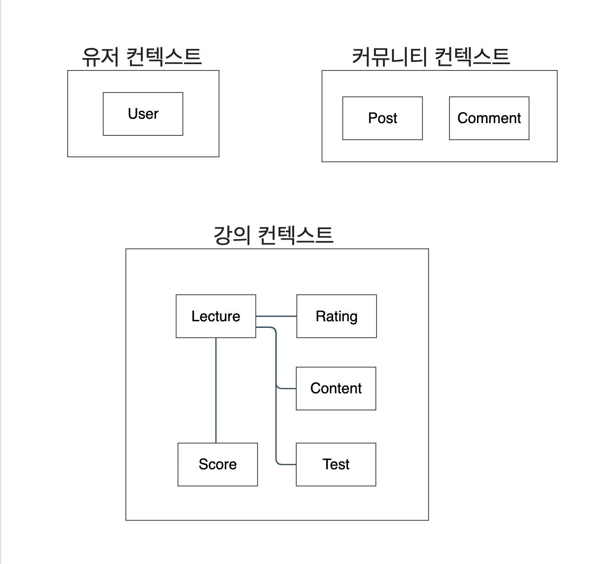

## 온라인 강의 학습, 커뮤니티를 만든다면?

### Step 1 - 기능 정의 (학생)

1. 강의를 수강하고자 하는 사람은 ‘학생’ 으로 회원 가입이 가능하다
2. ‘학생’ 회원은 원하는 강의를 선택해서 ‘수강 신청’ 할 수 있다
3. ‘학생’ 회원은 ‘수강 신청’ 한 강의 컨텐츠를 열람할 수 있다
4. ‘학생’ 회원은 수강한 강의에 대해 별점을 남길 수 있다
5. ‘학생’ 회원은 수강한 강의의 목록을 조회할 수 있다

### Step 2 - 기능 정의 (사이트 운영자)

1. 사이트 운영자는 강의 컨텐츠를 업로드할 ‘강사’ 회원을 생성할 수 있다
2. 사이트 운영자는 ‘강의’ 를 개설하고 ‘강사’ 를 매칭할 수 있다
3. 사이트 운영자는 ‘강의’ 를 ‘학생’ 회원에게 노출할 수 있다
4. 사이트 운영자는 ‘강의’ 노출을 종료하고 ‘학생’ 회원이 제출한 별점을 열람할 수 있다

### Step 3 - 기능 정의 (강사)

1. ‘강사’ 는 매칭된 ‘강의’ 에 컨텐츠를 업로드할 수 있다
2. ‘강사’ 는 과거에 매칭된 ‘강의’ 목록을 조회할 수 있다
3. ‘강사’ 는 ‘강의’ 컨텐츠에 ‘시험’ 컨텐츠를 추가할 수 있다
4. ‘강사’ 는 ‘강의’ 를 수강한 학생들의 성적을 입력할 수 있다

### Step 4 - 기능 정의 (공통)

1. ‘학생’, ‘사이트 운영자’, ‘강사’ 는 커뮤니티 게시판을 열람할 수 있다
2. ‘학생’, ‘사이트 운영자’, ‘강사’ 는 커뮤니티 게시판에 게시글을 작성할 수 있다
3. ‘학생’, ‘사이트 운영자’, ‘강사’ 는 커뮤니티 게시글에 댓글을 작성할 수 있다
4. ‘사이트 운영자’ 는 커뮤니티 게시글이나 댓글을 숨김 처리할 수 있다

### 요구사항 분석

- 도메인 모델 그리기
- MSA로 설계하기
- REST API 설계하기
- 각 Domain App의 Service Interface 정의하기

------

### 도메인 정의

- 회원

1. 사이트 운영자: 사전 정의
2. 강사: 사이트 운영자가 정의
3. 학생: 직접 회원 가입

- 강의

1. 생성 및 운영: 사이트 운영자
2. 컨텐츠 관리: 강사
3. 열람 및 별점: 학생

- 게시판

1. 작성 및 열람: 모두
2. 관리: 사이트 운영자

### 도메인 분리

- 회원 관리

1. 사이트 운영자: 사전 정의
2. 강사: 사이트 운영자가 정의
3. 학생: 직접 회원 가입

- 강의 관리

1. 생성 및 운영: 사이트 운영자
2. 컨텐츠 관리: 강사
3. 열람 및 별점: 학생

- 게시판 관리

1. 작성 및 열람: 모두
2. 관리: 사이트 운영자

## 도메인 모델 그리기

